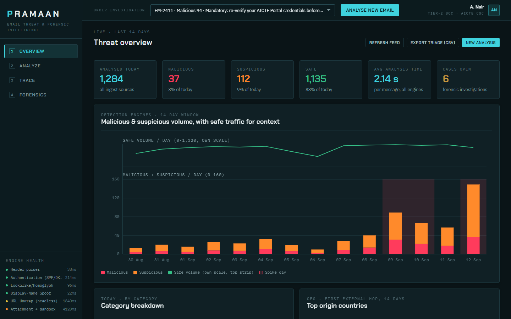
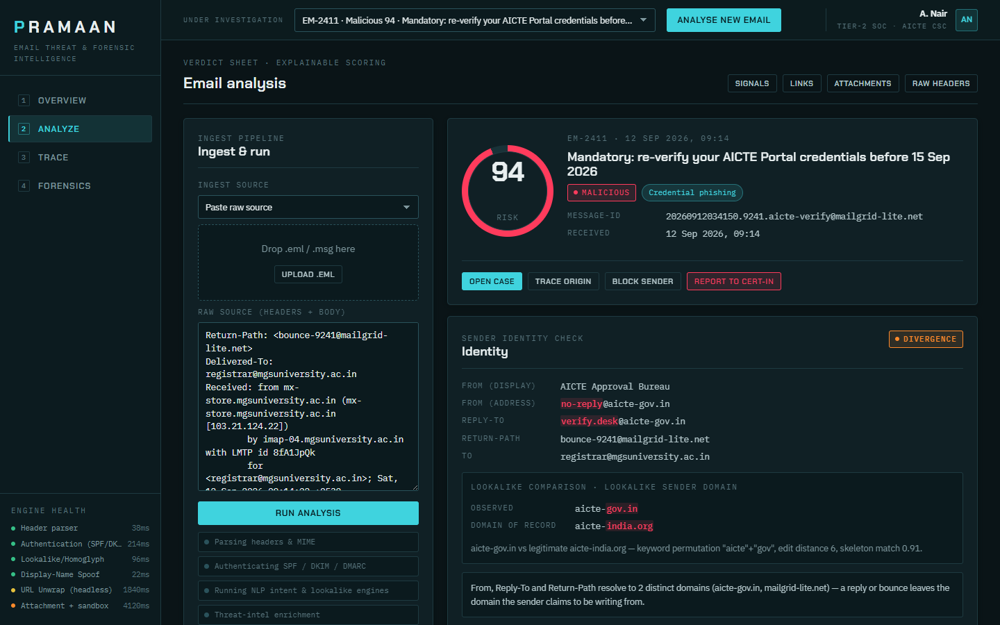
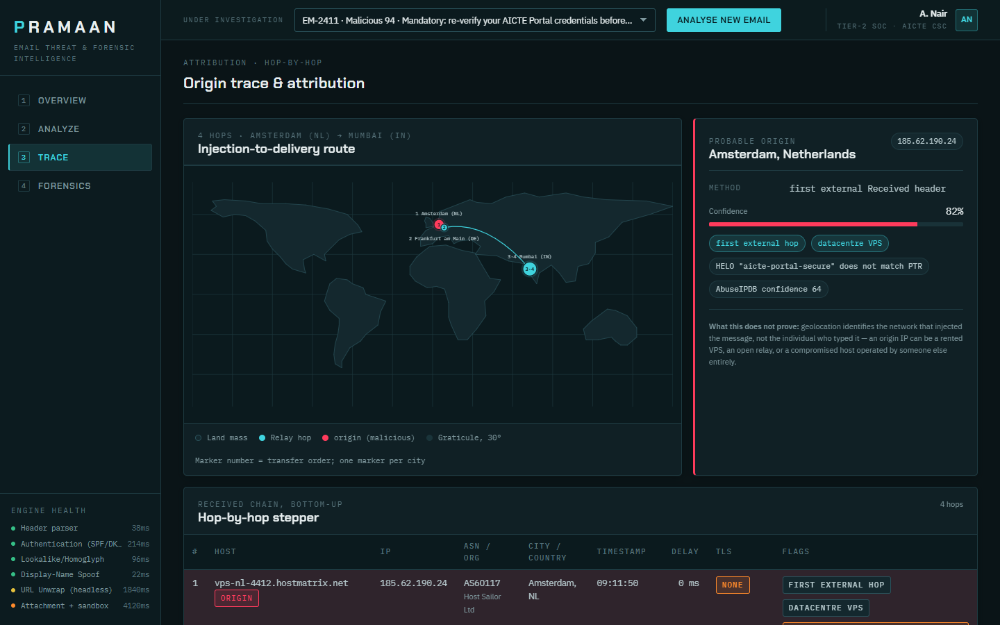
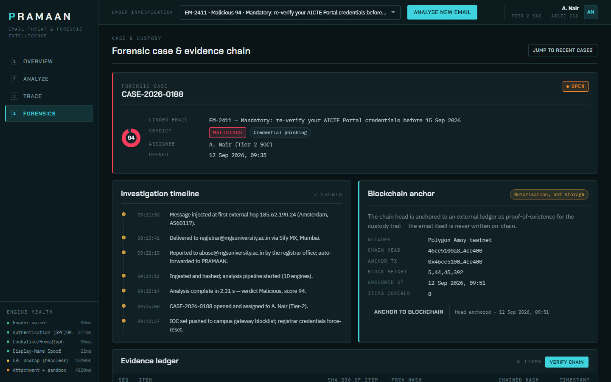

# PRAMAAN

**AI-powered email threat detection, geolocation and forensic intelligence.**
Prototype console for Smart India Hackathon problem statement 26106 (AICTE Cyber Security Cell · Software · Blockchain & Cybersecurity).

PRAMAAN (Sanskrit: *proof, evidence*) takes one suspicious email and answers the four questions an investigator actually has:

1. **Is it fraudulent?** A 0-100 risk score and a verdict.
2. **Why, exactly?** Every point of the score traced to a named signal with its evidence.
3. **Where was it really injected?** A hop-by-hop trace of the Received chain, geolocated and mapped, with an honest confidence.
4. **Can I prove it later?** A hash-chained evidence ledger, anchored to a blockchain, exportable as a report.

The prototype is a single HTML file. It ships with seven realistic sample emails and runs in any browser with no backend, no install and no network access.



---

## Contents

- [Why this exists](#why-this-exists)
- [What it does](#what-it-does)
- [Screens](#screens)
- [Installation](#installation)
- [Using the console](#using-the-console)
  - [SOC analyst: triage in one minute](#1-soc-analyst-triage-in-one-minute)
  - [Forensic investigator: attribution and evidence](#2-forensic-investigator-attribution-and-evidence)
  - [Institution IT admin: posture and coverage](#3-institution-it-admin-posture-and-coverage)
  - [Analysing a new email](#analysing-a-new-email)
- [Sample emails](#sample-emails)
- [Three-minute demo script](#three-minute-demo-script)
- [Use cases](#use-cases)
- [How the system works](#how-the-system-works)
- [Architecture](#architecture)
- [What is real and what is mocked](#what-is-real-and-what-is-mocked)
- [Project layout](#project-layout)
- [Development](#development)
- [Testing](#testing)
- [Roadmap](#roadmap)
- [Documents](#documents)
- [Contributing](#contributing)
- [License](#license)

---

## Why this exists

Email is the most exploited attack vector in government, education, banking and enterprise: phishing, impersonation, business email compromise, invoice fraud, credential theft, malware delivery. Spam filters, blacklists and signature rules stop the bulk case and miss the convincing minority: lookalike domains, display-name spoofing, AI-written lures with no grammar tells, hidden redirect chains, and BEC mails that carry no link and no attachment at all.

Worse, when an institution does catch one, it usually cannot answer the questions an incident report or FIR asks: which machine injected the message, through which relays, in what country, on whose network, whether it is the same infrastructure as last month's fraud, and whether the evidence will survive being challenged.

A spam filter answers *deliver or not*. PRAMAAN answers *fraudulent or not, why, from where, and with what proof*.

## What it does

| Capability | What you get |
|---|---|
| Ingest | Paste raw source, drop an `.eml`, or (full system) an IMAP/Gmail connector and a REST API |
| Authentication | SPF, DKIM and DMARC with alignment against the *displayed* brand, not just the raw domain |
| Identity checks | Display-name spoofing, From / Reply-To / Return-Path divergence, lookalike and homoglyph domains with domain age |
| Link analysis | Shown text vs actual destination, redirect chains unwrapped to the landing page |
| Attachments | Hashes, type sniffing, macro and PDF action detection, sandbox hooks |
| NLP intent | Credential request, wire redirection, urgency and authority pressure, secrecy instruction: the engine that catches zero-payload BEC |
| Explainable scoring | A signal table where every row carries engine, weight, fired/clear and the evidence string |
| Origin trace | Received chain parsed bottom-up, first external hop marked as probable origin, per-hop delay and TLS |
| Geolocation | IP to city, country, ASN and hosting type, drawn on a map with a route |
| Campaign clustering | Similarity to prior cases by shared infrastructure, URL templates and content |
| Forensic case | Case header, typed timeline, IOC table with copy and CSV export |
| Evidence ledger | Every artefact hashed and chained; verify the chain; anchor the chain head to a blockchain |
| Reports | PDF, JSON bundle, STIX 2.1, gateway blocklist push, CERT-In escalation |

## Screens

**Overview**: the SOC console. KPI strip, 14-day threat chart with a marked spike day, category breakdown, top origin countries, triage queue of analysed emails, engine health, recent cases.

**Analyze**: the verdict sheet for one email. Ingest panel, score ring and verdict, identity check with lookalike comparison, SPF/DKIM/DMARC tiles, the signal table, AI analyst narrative, body preview with deceptive links exposed, attachments, raw headers.



**Trace**: attribution. Low-poly world map with numbered hop markers and the route, probable-origin card with confidence and a plain-language caveat, hop-by-hop stepper with anomaly flags, contradiction banner, IOC table, related campaigns, raw Received headers that highlight when you hover a hop.



**Forensics**: case and custody. Case header, investigation timeline, blockchain anchor panel, evidence ledger with verify-chain, export and action bar, recent cases.



## Installation

There are three ways to run it. Pick the first unless you have a reason not to.

### Option A: open the file (no install)

1. Download or clone the repository.
2. Double-click `pramaan.html`.

Works in Chrome, Edge, Firefox and Safari. Everything is inline: fonts fall back to system faces if you are offline.

### Option B: local server

Some browsers block clipboard access on `file://` pages, which only affects the Copy buttons. If that matters, serve the folder:

```bash
git clone https://github.com/thedhanrajsingh/pramaan.git
cd pramaan
python -m http.server 8765
```

Open http://localhost:8765/pramaan.html. Any static server works (`npx serve`, nginx, VS Code Live Server).

### Option C: development setup

Needed only to rebuild the page or run the tests.

| Tool | Version | Used for |
|---|---|---|
| Python | 3.8+ | `assemble.py` (rebuild) and the optional local server |
| Node.js | 18+ | test suite |
| Google Chrome | any recent | the tests drive the installed Chrome headlessly |

```bash
git clone https://github.com/thedhanrajsingh/pramaan.git
cd pramaan
cd test && npm install && cd ..
python assemble.py
node test/smoke.js
```

## Using the console

Layout: a left rail with the four screens and engine health, a top bar with the **email under investigation** selector and an **Analyse new email** button, and the active screen. Every screen renders the selected email; change the selector and all four screens update. The URL hash tracks the screen (`#/trace`), so screens are bookmarkable.

### 1. SOC analyst: triage in one minute

Goal: verdict, reason for the ticket, block list.

1. **Overview** opens first. Read the KPI strip and the 14-day chart. The shaded column is a spike day.
2. Scroll to the **Triage queue**. Each row is an analysed email: received time, sender, subject, category, score ring, verdict badge. Click a row. It becomes the email under investigation and you land on Analyze.
3. On **Analyze**, the verdict block shows the score ring, the verdict badge and the category. The **AI analyst narrative** below the signal table is written in plain investigator language; paste it into the ticket.
4. Check the **SPF / DKIM / DMARC** tiles. A fail or none is highlighted in red, with the detail line explaining what was checked.
5. Read the **Signal table**. It is sorted fired-first, heaviest first. Each row names the engine, the weight it contributed, and the evidence string. The footer shows the total contribution and the meta-model score.
6. Under **Body preview & links**, the deceptive link is shown three ways: the text the victim saw, the actual URL, and the redirect chain to the final page.
7. Act from the verdict block: **Block sender** and **Report to CERT-In** confirm with a toast. **Trace origin** and **Open case** take you to the next screens.

### 2. Forensic investigator: attribution and evidence

Goal: where it came from, who else it hit, and evidence that holds.

1. Select the email in the top bar, or click it in the Overview triage queue.
2. On **Trace**, the map draws the injection-to-delivery route. Numbered markers are hops in transfer order; the red marker is the probable origin. Co-located hops share a marker.
3. The **Probable origin** card gives IP, city, country, confidence and the method (first external Received header). Read **What this does not prove** before writing it into a report: geolocation identifies the injecting network, not the person, and the IP can be a rented VPS, an open relay or a compromised host.
4. The **Hop-by-hop stepper** lists every relay: host, IP, ASN and organisation, city, timestamp, delay since the previous hop, TLS, and flags. Anomalies are highlighted: missing TLS, HELO not matching PTR, timestamp skew, bulk-sender infrastructure, seen in prior campaigns. Trusted hops inside the recipient's own boundary are marked. Hover a row to highlight its lines in the **Raw Received headers** panel.
5. A **Contradiction detected** banner appears when the claimed sender geography conflicts with the observed origin.
6. The **IOC table** lists domains, URLs, IPs and addresses with confidence and source. **Copy** puts one on the clipboard. **Export IOC set (CSV)** exports the set.
7. **Related campaigns** shows prior clusters sharing infrastructure, with a similarity bar, first-seen date and message count. Pivot to campaign opens that cluster.
8. On **Forensics**, the case header shows case id, status, assignee, opened time and severity. The **Investigation timeline** is the typed event log from injection to containment.
9. The **Evidence ledger** lists every artefact in sequence with its SHA-256 and its chained hash (`hash_n = SHA256(prev_hash || sha256(item) || timestamp)`). Press **Verify chain** to walk it; the result line reports intact, or the first broken sequence number.
10. **Anchor to blockchain** notarises the chain head on a public testnet and shows the transaction id. Only the hash leaves the system; the email is never written on-chain.
11. From the **Export & action bar**: Generate PDF report, Export JSON bundle, Export STIX 2.1 + CSV IOCs, Push IOCs to gateway blocklist, Escalate to CERT-In. Every export embeds the ledger and the anchor record so a court or a second investigator can re-verify the chain.

### 3. Institution IT admin: posture and coverage

Goal: what is hitting us, from where, and is the pipeline healthy.

1. **Overview** is the daily view. **Category breakdown** shows which fraud types dominate. **Top origin countries** shows where injections come from over the window.
2. **Engine health** in the rail and at the foot of Overview shows every detection engine's status and latency. Degraded or backlogged engines are flagged.
3. **Recent cases** shows what is open, its status and its owner. Case file opens the case on Forensics.
4. Switch the selector to the two Safe samples (NIC maintenance notice, AICTE handbook) to see a clean verdict: DMARC aligned, only low-weight signals, low score. This is what a false-positive review looks like.

### Analysing a new email

1. Click **Analyse new email** in the top bar. You land on Analyze with the ingest panel focused.
2. Choose the ingest source: **Paste raw source** or **Upload .eml**. Raw source is the "Show original" text any mail client exposes; it is the zero-friction path for a victim who has nothing installed.
3. Paste into the text area and press **Run analysis**. The staged progress shows the pipeline: parsing headers and MIME, authenticating SPF/DKIM/DMARC, running the NLP and lookalike engines, threat-intel enrichment, meta-model scoring.
4. The verdict sheet fills in.

In the prototype the engines are not wired to a backend, so the verdict shown after a run is that of the currently selected sample. The full pipeline that replaces this is described in [docs/solution.md](docs/solution.md).

## Sample emails

The dataset is built around Indian public-sector victims: a state university, a public-sector bank's operations desk, AICTE itself, and a ministry.

| ID | Category | Verdict | What it demonstrates |
|---|---|---|---|
| EM-2411 | Credential phishing | Malicious 94 | Lookalike domain `aicte-gov.in` vs the real `aicte-india.org`, six days old; SPF fail; DMARC unaligned; two-hop redirect to a credential-harvest page; injected from a VPS in Amsterdam, relayed via Frankfurt, delivered in Mumbai |
| EM-2410 | BEC / CEO fraud | Malicious 88 | Display-name spoof of the Vice-Chancellor, no link, no attachment, passes every filter; caught on wire-redirection intent, authority pressure and secrecy instruction |
| EM-2409 | Invoice fraud | Suspicious 79 | Bank-detail change request from a lookalike vendor TLD; SPF softfail; PDF with an embedded action |
| EM-2408 | Malware delivery | Malicious 91 | GST notice with a macro-enabled `.xlsm`; payload URL in the redirect chain; hash IOCs |
| EM-2407 | Lookalike domain | Malicious 85 | Homoglyph domain impersonating the education ministry; DKIM body-hash failure |
| EM-2406 | Legitimate | Safe 6 | Clean, authenticated bulk notice from NIC |
| EM-2405 | Legitimate | Safe 18 | Real AICTE mail, DMARC aligned, with a deadline and an attachment that raise only low-weight signals |

## Three-minute demo script

| Time | Screen | Say |
|---|---|---|
| 0:00 | Overview | "1,284 mails analysed today, 37 malicious, 6 open cases." Point at the spike day in the chart. |
| 0:25 | Analyze (click the AICTE row) | "Score 94. SPF fails, DMARC is unaligned, and `aicte-gov.in` is a six-day-old lookalike of the real `aicte-india.org`." Scroll the signal table: every point is accounted for. |
| 1:00 | Analyze, links | "The mail shows `aicte-india.org/approval/verify`. The real destination is a `.top` harvest page after two redirects." |
| 1:20 | Trace | "The mail claims Delhi. The first external hop is a VPS in Amsterdam, relayed via Frankfurt, delivered to the university MX in Mumbai. Origin confidence 82 percent." |
| 1:50 | Trace, campaigns | "87 percent similar to a cluster that hit two other universities: same ASN, same URL template. One mail just became a campaign." |
| 2:10 | Analyze (select the BEC sample) | "No link, no attachment, passes every filter. Intent is wire redirection plus authority pressure, display name spoofs the Vice-Chancellor. Score 88." |
| 2:30 | Forensics | Verify chain: "8 items, chain intact." Anchor. Export the report. "That is what an investigator can actually file." |

## Use cases

- **University or college IT cell.** Students and staff forward suspicious mail to an `abuse@` address. PRAMAAN analyses each one, produces a block list for the campus gateway, and links repeat campaigns targeting the institution.
- **Public-sector bank operations desk.** Vendor bank-mandate changes and RTGS instructions are checked for intent and identity before payment. Zero-payload BEC is caught on language and identity, not on links.
- **Ministry or regulator (AICTE, NIC).** Monitor which of your domains are being impersonated, how old the lookalikes are, and where the injecting infrastructure sits. Escalate with a pre-filled CERT-In package.
- **CERT / state cyber cell.** Attribute a reported fraud to infrastructure, correlate with prior incidents, and produce a report annexure whose evidence chain is externally notarised.
- **Security awareness training.** The Analyze screen is a teaching tool: the shown-vs-actual link, the identity divergence and the lookalike diff make the deception visible.

## How the system works

An email moves through ten stages. The prototype shows the output of each; the full build implements them.

1. **Ingest.** `.eml` upload, pasted raw source, IMAP/Gmail connector, or `POST /v1/analyse`. The raw message is stored immutably and SHA-256 hashed on arrival: evidence item #1.
2. **Parse.** RFC 5322 headers (duplicates and malformations kept as signals), MIME tree, URL extraction from text, HTML, `meta refresh` and inline scripts, attachment type sniffing by magic bytes, full `Received` chain parse.
3. **Detection engines** run in parallel and each emits scored signals with evidence: authentication with alignment, header anomaly, lookalike/homoglyph with domain age, display-name spoofing, URL and redirect unwrapping with landing-page similarity, attachment analysis with sandbox hooks, NLP intent classifier, AI-generated-text signal (supporting weight only), threat-intel enrichment.
4. **Explainable scoring.** A gradient-boosted meta-model over the signals returns 0-100 with per-signal contributions. Hard rules cap DMARC-aligned mail from allow-listed government domains.
5. **Hop-by-hop trace.** The Received chain is read bottom-up (each relay prepends its line, so the bottom-most is the earliest). The first hop outside the recipient's trust boundary is the probable origin. Declared HELO names are untrusted; only observed IPs feed geolocation.
6. **Geo and ASN correlation.** Offline MaxMind GeoLite2 City and ASN, reverse DNS, hosting-type classification (residential, mobile, datacentre VPS, Tor exit, bulletproof host), contradiction flag when claimed and observed geography conflict.
7. **Campaign clustering.** Each mail becomes a fingerprint (ASN set, HELO and TLS pattern, registrar and domain-creation window, URL template, content embeddings, attachment fuzzy hashes). Nearest-neighbour search links it to prior campaigns.
8. **Case management.** Case id, assignee, status, linked emails, consolidated IOCs, action log.
9. **Evidence ledger.** Every artefact hashed and appended to a per-case hash chain; the chain head is anchored externally (Hyperledger Fabric on-premise, or a Polygon testnet transaction in the hackathon build). Custody is notarised; mail content never goes on-chain.
10. **Export.** PDF/DOCX report, STIX 2.1 bundle, CSV IOC feed, pre-filled CERT-In incident template.

Full detail, including the training-data plan, evaluation metrics and the ethics section, is in [docs/solution.md](docs/solution.md).

## Architecture

```
mail clients / abuse@ mailbox / gateway
    | .eml · paste · IMAP-Gmail OAuth · REST
    v
Next.js + React console  -->  FastAPI gateway (JWT, RBAC: analyst / investigator / admin)
                                    |
                              Redis Streams queue
                                    v
                      Celery worker pool — engine fan-out
  parser · auth (SPF/DKIM/DMARC) · header anomaly · lookalike · URL unwrap (Playwright)
  attachment + sandbox · NLP transformer (TorchServe) · LightGBM meta-scorer · TI enrichment
                                    |
  Postgres (cases, emails, signals, hops, IOCs, ledger) · pgvector (campaign similarity)
  MinIO/S3 (raw .eml, screenshots) · MaxMind GeoLite2 (local) · ledger anchor client
```

Offline-first by design: the geo database, the Public Suffix List and the models ship locally so a campus or ministry deployment works with no egress. Threat-intel lookups are opt-in per API key.

This repository holds the console. The prototype console is framework-free (plain HTML, CSS and JavaScript) so it can be opened anywhere; the production console would be the Next.js app above, reusing the same screens and tokens.

## What is real and what is mocked

**Real code:** the four screens, navigation and hash routing, the email selector and cross-screen state, the SVG chart and the equirectangular map projection with a low-poly basemap, the Received-block-to-hop matching that powers the hover highlight, the evidence-chain walk, every table, badge and toast.

**Mocked by the sample dataset:** detection-engine output, geolocation lookups, threat-intel enrichment, sandbox verdicts, campaign similarity, blockchain transaction ids, and the exports (which confirm with a toast rather than producing a file).

The dataset in `spec/data.js` is the contract between the console and the backend. Every field the screens read is what the corresponding API would return.

## Project layout

```
pramaan.html            the interface, standalone (open this)
assemble.py             builds pramaan.html from spec/ + sections/
README.md               this file
LICENSE                 MIT

spec/
  blueprint.md          solution blueprint: modules, architecture, stack, MVP scope, demo flow
  conventions.md        contract every screen follows (markup, registration, styling, data access)
  tokens.css            design tokens and shared component classes
  data.js               sample dataset: 7 emails, dashboard aggregates, map basemap helper
  shell.html            app frame, navigation, top bar, the App core (routing, state, helpers, toasts)

sections/
  overview.html         Overview screen
  analyze.html          Analyze screen
  trace.html            Trace and geolocation screen
  forensics.html        Forensics and case screen

docs/
  solution.md           the solution proposal: what can be built, in 14 sections
  resources.md          verified datasets, libraries, threat-intel APIs, blockchain anchoring, CERT-In links
  audit.md              code audit and test report
  screenshots/          the four screens at 1440x900

test/
  smoke.js              headless-Chrome smoke test
  harness.js            shared boot layer for the screen tests
  overview.test.js      one test per screen, asserting the DOM against the dataset
  analyze.test.js
  trace.test.js
  forensics.test.js
  package.json          the single test dependency (playwright-core)
```

## Development

The page is assembled from parts so each screen can be edited on its own.

**Rebuild after any edit under `spec/` or `sections/`:**

```bash
python assemble.py
```

**How a screen is structured.** Each file in `sections/` is one `<section class="screen" id="screen-<name>" hidden>` with optional section-scoped CSS (every selector prefixed with the section id) and a script that registers `{ mount(root, ctx), onSelect(email, ctx) }` by pushing onto `window.__screens`. The App core in `spec/shell.html` mounts each screen once, then calls `onSelect` whenever the email under investigation changes. `ctx` gives the screen the dataset, formatting helpers, `select(id)`, `go(screen)` and `toast(msg)`. The full contract is in `spec/conventions.md`.

**Add a sample email.** Append an object to `EFP_DATA.emails` in `spec/data.js` following the shape of the existing ones (headers, auth, signals, links, attachments, hops, origin, IOCs, campaigns, timeline, evidence ledger). Rebuild. It appears in the selector, the triage queue and every screen.

**Add a screen.** Create `sections/<name>.html` per the conventions, add it to the list in `assemble.py`, add a nav button and the id to `SCREEN_IDS` in `spec/shell.html`. Rebuild and run the smoke test.

**Change the look.** Colours, type, spacing and every shared component class live in `spec/tokens.css`. The design commits to one dark console theme; the palette is documented at the top of that file.

## Testing

Requires Node 18+ and an installed Google Chrome. Install the one dependency once:

```bash
cd test && npm install && cd ..
```

Run the smoke test. It boots the page headlessly, checks all four screens register and render, pushes all seven emails through every screen, clicks every button, and verifies hash routing, the selector, and that no `undefined` or `NaN` leaks into the UI:

```bash
python assemble.py && node test/smoke.js
```

Run the screen tests. Each asserts the rendered DOM against the live dataset: KPI values, chart bar counts, triage rows, score rings, auth results, signal ordering, hop rows, map markers, origin confidence, ledger rows, the verify-chain result, and every action button:

```bash
node test/overview.test.js && node test/analyze.test.js && node test/trace.test.js && node test/forensics.test.js
```

Each test prints a JSON result and exits non-zero on failure. Screenshots from the smoke run land in `test/shots/` (ignored by git).

## Roadmap

**Hackathon MVP (this prototype plus the backend it specifies):** `.eml` upload and raw paste, full parser, SPF/DKIM/DMARC via libraries, header-anomaly, lookalike/homoglyph, display-name and URL-chain engines, NLP intent classifier fine-tuned on public phishing corpora plus synthetic Indian-context BEC, transparent weighted score, hop parse with offline geolocation and the map, campaign similarity over a seeded corpus, case creation, hash-chained ledger with one testnet anchor, PDF export.

**Full scope:** live IMAP and Microsoft Graph connectors and inline gateway mode, real sandbox detonation, RDAP and certificate-transparency monitoring for newly registered lookalikes of your own domains, analyst-feedback retraining loop, multi-tenant onboarding, Indic-language NLP, automated CERT-In filing, mobile triage app.

## Documents

- [docs/solution.md](docs/solution.md): the solution proposal. The gap, what we build, the pipeline, the detection engines, explainable scoring, tracing and geolocation, forensic intelligence, architecture, data and training plan, MVP vs roadmap, security and ethics, demo script, judging alignment.
- [docs/resources.md](docs/resources.md): link-checked datasets (Nazario, SpamAssassin, Enron, CLAIR, TREC), lookalike tools, authentication libraries, geolocation and threat-intel sources with free-tier limits, models on Hugging Face, blockchain anchoring options, STIX and report libraries, the CERT-In 6-hour reporting directive, and five gotchas.
- [docs/audit.md](docs/audit.md): the code audit and the test report.
- [spec/blueprint.md](spec/blueprint.md): the architect's blueprint the build followed.

## Contributing

Issues and pull requests are welcome. Keep a change to one screen or one spec file where possible, rebuild with `assemble.py`, and make sure `node test/smoke.js` and the screen test for any screen you touched still pass before opening a PR.

## License

MIT. See [LICENSE](LICENSE).
